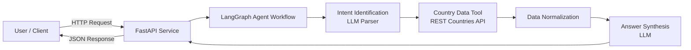
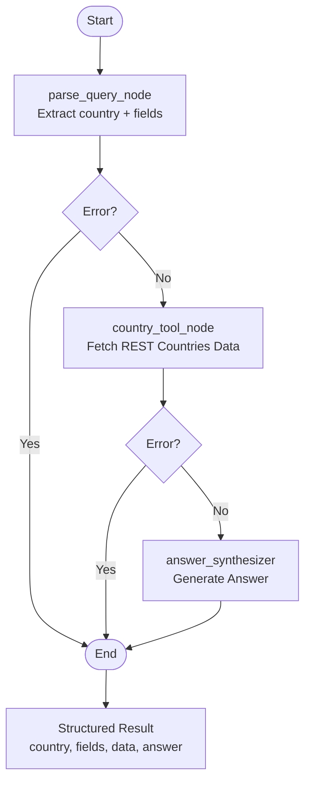

# Country Information AI Agent

This project implements an AI agent that answers questions about countries using public data from the REST Countries API.
Users can ask questions in natural language such as:

* What is the population of Germany?
* What currency does Japan use?
* What is the capital and population of Brazil?

The system extracts the relevant information from the query, retrieves grounded data from the API, and produces a concise answer.

The agent is implemented using **LangGraph** and follows a structured workflow with three steps: intent identification, tool invocation, and answer synthesis.

---

# Example

Request

```json
{
  "question": "What is the capital and population of Brazil?"
}
```

Response

```json
{
  "country": "Brazil",
  "fields": ["capital", "population"],
  "data": {
    "capital": "Brasília",
    "population": 214326223
  },
  "answer": "The capital of Brazil is Brasília. The country has a population of approximately 214 million people."
}
```

---

# High Level Design

The system exposes a simple HTTP API. A request flows through a LangGraph workflow that identifies the user’s intent, retrieves country data, and generates the final answer.



---

# Low Level Design

The LangGraph workflow is composed of three nodes that operate on a shared state object.



---

# Agent Workflow

**1. Intent Identification**

The agent first parses the user query using an LLM.
It extracts two pieces of information:

* the country name
* the requested data fields

Structured output with a Pydantic schema is used to ensure consistent extraction.

**2. Tool Invocation**

The agent then calls the REST Countries API using the extracted country name.

The API response is passed through a normalization step that converts the nested JSON structure into a simpler and predictable format.

**3. Answer Synthesis**

The final step uses an LLM to generate a natural language response using only the retrieved country data.

The result returned by the API contains both the structured data and the generated answer.

---

# Project Structure

```
country-info-agent
│
├── api
│   └── server.py
│
├── app
│   ├── config.py
│
│   ├── graph
│   │   └── agent_graph.py
│
│   ├── models
│   │   └── state.py
│
│   ├── nodes
│   │   ├── intent_parser.py
│   │   ├── country_tool_node.py
│   │   └── answer_synthesizer.py
│
│   ├── tools
│   │   └── rest_countries_tool.py
│
│   └── utils
│       └── normalizer.py
│
├── requirements.txt
└── README.md
```

---

# Running the project locally

Create a virtual environment

```bash
python -m venv venv
source venv/bin/activate
```

Install dependencies

```bash
pip install -r requirements.txt
```

Create a `.env` file

```
GROQ_API_KEY=your_api_key
MODEL_NAME=llama-3.1-8b-instant
```

Start the server

```bash
uvicorn api.server:app --reload
```

The API will be available at

```
http://127.0.0.1:8000
```

---

# Testing the agent

Example request using curl

```bash
curl -X POST http://127.0.0.1:8000/ask \
-H "Content-Type: application/json" \
-d '{"question":"What currency does Japan use?"}'
```

Health check endpoint

```
GET /health
```

---

# Design considerations

The system is designed to resemble a small production service rather than a single prompt pipeline.

Key decisions include:

* A structured state object passed between LangGraph nodes
* Clear separation between LLM reasoning and external data retrieval
* Data normalization to simplify API responses
* Deterministic LLM configuration for extraction tasks
* Error handling with early graph termination

---

# Limitations

The system relies on the REST Countries API for data accuracy.
Country name extraction depends on the LLM and may fail for ambiguous queries.
The agent currently supports a limited set of country attributes.

---
